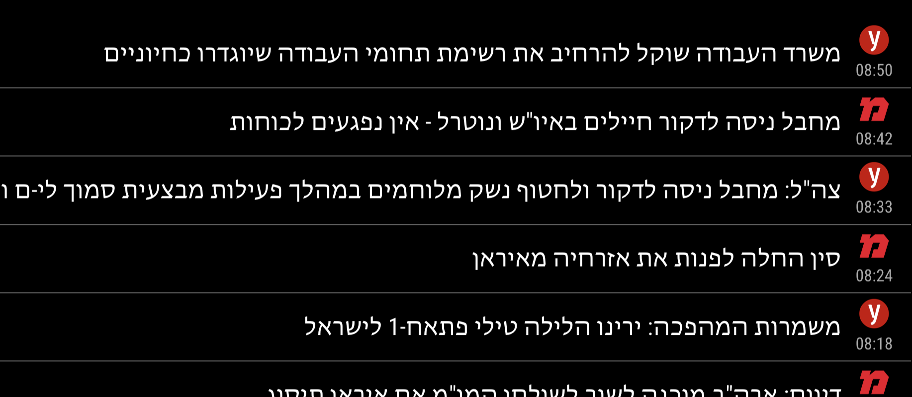

# MMM-IsraelNews

MMM-IsraelNews is a MagicMirror module that displays the latest news headlines from Israel in Hebrew. It fetches news from an RSS feed and presents it in a vertical scrolling format.



## Features

- Fetches news headlines from multiple Israeli news RSS feeds.
- Time-based filtering: shows only news from the last few hours (configurable).
- Chronological display: news items are sorted from oldest to newest for natural timeline flow.
- Smooth scrolling animation for headlines exceeding the display limit.
- Displays favicons for different news sources.
- Shows timestamps for each news item.
- Easy integration with the MagicMirror framework.

## Installation

1. Navigate to the `modules` directory of your MagicMirror installation.
2. Clone this repository into the `MMM-IsraelNews` folder:

   git clone https://github.com/yourusername/MMM-IsraelNews.git

3. Navigate into the `MMM-IsraelNews` directory:

   cd MMM-IsraelNews

4. Install the required dependencies:

   npm install

## Configuration

Add the following configuration to your `config/config.js` file:

```javascript
{
  module: 'MMM-IsraelNews',
  position: 'top_bar', // Position where the module will be displayed
  config: {
    scrollSpeed: 200,    // Scroll speed in milliseconds (default: 200)
    updateInterval: 600, // Update interval in seconds (default: 600 = 10 minutes)
    newsHoursBack: 4,    // Show news from the last 4 hours only (default: 4)
    urls: [              // Array of RSS feed URLs
      "https://www.ynet.co.il/Integration/StoryRss1854.xml",
      // "https://www.srugim.co.il/feed",
      // "https://rss.walla.co.il/feed/22",
      // "https://www.maariv.co.il/Rss/RssFeedsMivzakiChadashot"
    ]
  }
}
```

## Configuration Options

| Option | Type | Default | Description |
|--------|------|---------|-------------|
| `scrollSpeed` | Number | 200 | Speed of scrolling animation in milliseconds |
| `updateInterval` | Number | 600 | How often to fetch new news in seconds (600 = 10 minutes) |
| `newsHoursBack` | Number | 4 | Show news from the last X hours only (filters out older news) |
| `urls` | Array | See example | Array of RSS feed URLs to fetch news from |

## Usage

Once installed and configured, the MMM-IsraelNews module will automatically fetch and display the latest news headlines from the configured RSS feeds. The module will:

- Display news with favicons from different sources
- Show timestamps for each news item
- Sort news chronologically from oldest to newest for natural timeline flow
- Filter news to show only items from the specified time period (last 4 hours by default)
- Update news every `updateInterval` seconds

You can customize the number of visible headlines, scroll speed, time filtering period, and add multiple RSS feeds by modifying the configuration options.

## License

This project is licensed under the MIT License. See the LICENSE file for details.
